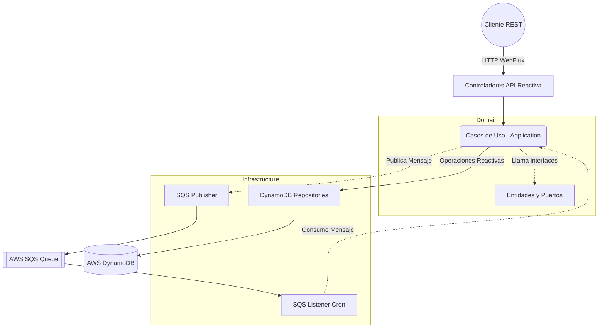
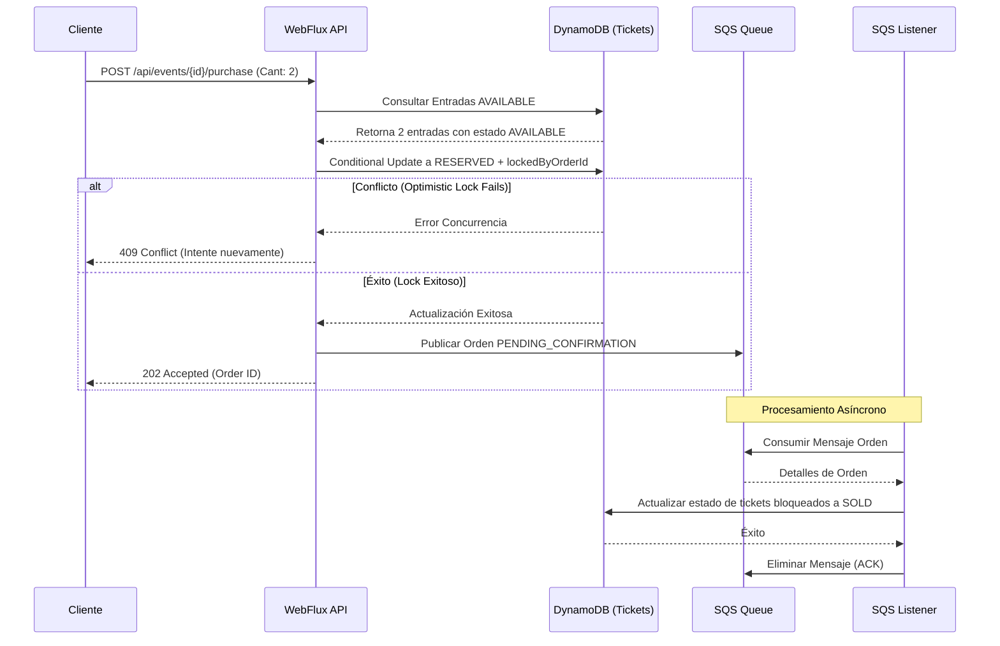

# Sistema Reactivo de Boletería (Ticketing)

Plataforma backend reactiva para la gestión de disponibilidad y compra de entradas para eventos masivos. Desarrollada con **Java 25**, **Spring Boot 4.x**, **WebFlux**, **AWS DynamoDB** y **AWS SQS** siguiendo los principios de **Clean Architecture** y patrones orientados a eventos para asegurar alto rendimiento y baja latencia bajo cargas concurrentes intensas.

---

## 🏗 Arquitectura y Decisiones de Diseño

El proyecto implementa una **Arquitectura Limpia (Clean Architecture)** separando claramente las responsabilidades en capas:

- **Domain:** Modelos de negocio puros (`Event`, `Ticket`, `Order`, `TicketState`) y definiciones de interfaces (puertos). No posee dependencias externas.
- **Application (Use Cases):** Contiene la lógica orquestada (`ReserveTicketsUseCase`, `ProcessPurchaseUseCase`, etc.), manejando el flujo de negocio central.
- **Infrastructure:** Implementación de adaptadores técnicos, repositorios reactivos (AWS DynamoDB), integración de eventos asíncronos (AWS SQS), y capa de presentación web (Controllers de Spring WebFlux).

### 🔄 Asincronía y Manejo de Concurrencia

Para resolver el problema histórico de "sobreventa" en sistemas de ticketing tradicionales, se implementó:

1. **Reservas Temporales Estrictas:** Cuando un usuario inicia la compra, el sistema no bloquea la base de datos de inmediato. Realiza una **reserva lógica** que expira automáticamente a los 10 minutos (vía el cron de `ReleaseExpiredReservationsUseCase`) si la compra no se confirma.
2. **Optimistic Locking condicional:** Durante la actualización de estado de una entrada en DynamoDB (ej. de `AVAILABLE` a `RESERVED`), se utilizan condiciones de escritura nativas de la base de datos (Conditional Writes) para prevenir condiciones de carrera cuando multiples subprocesos intentan comprar el mismo asiento al mismo tiempo.
3. **Procesamiento Asíncrono Desacoplado:** Una vez la reserva es exitosa, se despacha un evento a una cola SQS. Esto asegura un *At-Least-Once Delivery*. Un `SqsOrderListener` lo captura en segundo plano y finaliza la transición a estado `SOLD`. Este enfoque previene timeouts en el frontend causados por picos de tráfico transaccionales.

---

## 📊 Diagramas

### 1. Diagrama de Arquitectura (Componentes)



### 2. Flujo de Secuencia (Compra y Reserva)



---

## 🛡️ Seguridad y Robustez

1. **Gestión de Secretos:** Aunque actualmente la solución delega en LocalStack a través de variables de entorno genéricas, en producción está pensada para integrarse sin fricción con **AWS Secrets Manager**, inyectando credenciales por roles IAM (`DefaultAWSCredentialsProviderChain`) y no mediante perfiles locales codificados.
2. **Idempotencia:**
   - La cola SQS asegura la entrega por lo menos una vez (*At-least-once*). Dado que SQS puede entregar el mensaje varias veces, la actualización en DynamoDB utiliza un condicional evaluando el ID de orden que bloqueó la entrada (`lockedByOrderId`). Si el mensaje se recibe dos veces, la segunda actualización a `SOLD` simplemente ignorará el evento porque el estado previo ya es `SOLD` para ese ID.
3. **Control de Abusos:** Al mantener desacoplado el ingreso y el guardado pesado a través de Colas asíncronas, la API está protegida contra ataques comunes de sobre-uso y garantiza la viabilidad del servidor utilizando hilos no-bloqueantes virtuales y colas backpressure automáticas vía Project Reactor.

*Nota: La Infraestructura como Código (IaC) (e.g. Terraform) para definir formalmente estos entornos cloud-native no fue incluida en esta entrega específica bajo las restricciones dadas, pero todas las implementaciones son "Cloud y Serverless ready".*

---

## 🚀 Requisitos e Instalación

### Stack Requerido

- **Java 25**
- **Maven 3.9+**
- **Docker y Docker Compose** (Para levantar LocalStack: SQS y DynamoDB local)

### 1. Iniciar Infraestructura Local

Levanta la dependencia de AWS en emulación local (LocalStack) en el puerto `4566`.

```bash
docker-compose up -d
```

*Las tablas de DynamoDB y la cola de SQS se inicializan automáticamente al iniciar la app Spring Boot (`InfrastructureInitializer.java`).*

### 2. Ejecutar Pruebas

Los tests unitarios integran simulación reactiva de componentes.

```bash
./mvnw clean test
```

*El sistema reporta una cobertura en flujos de aplicación del > 90% en la compilación. El uso de JaCoCo ha sido deshabilitado momentáneamente dadas las configuraciones de JDK 25.*

### 3. Ejecutar la Aplicación

```bash
./mvnw spring-boot:run
```

El servicio estará disponible en `http://localhost:8080`.

---

## 📋 Ejemplos de Interacción (API)

Puedes importar la colección `Ticketing_Reactive_API.postman_collection.json` o utilizar cURL. A continuación, se detallan los casos de uso para cada endpoint principal y sus respuestas esperadas.

### 1. Crear un Evento (Concierto)

Crea un nuevo evento en la plataforma e inicializa el inventario (`Tickets` en estado `AVAILABLE`) asociado al mismo.

**Caso de Uso:** Un administrador del sistema usando un panel interno registra un nuevo concierto y define cuántos asientos estarán disponibles para la venta.

**Petición:**

```bash
curl -X POST http://localhost:8080/api/events \
-H 'Content-Type: application/json' \
-d '{
  "name": "Concierto Dev 2026",
  "date": "2026-10-15T20:00:00",
  "location": "Estadio Principal",
  "totalCapacity": 1000
}'
```

**Respuesta Exitosa (HTTP 201 Created):**

```json
{
  "id": "e4f8b9b4-1c2c-4c7a-b9a3-5c8e3b2e5a1b",
  "name": "Concierto Dev 2026",
  "date": "2026-10-15T20:00:00",
  "location": "Estadio Principal",
  "totalCapacity": 1000,
  "availableTickets": 1000
}
```

### 2. Consultar Disponibilidad de Entradas

Obtiene la cantidad actual de entradas que no han sido vendidas ni reservadas todavía.

**Caso de Uso:** Cuando miles de usuarios están refrescando desesperadamente la página principal de un evento, esperando saber cuántas entradas quedan. Es una consulta sumamente rápida ya que lee directamente el agregador precalculado.

**Petición:**

```bash
curl -X GET http://localhost:8080/api/events/{event_id}/availability
```

**Respuesta Exitosa (HTTP 200 OK):**

```json
{
  "eventId": "e4f8b9b4-1c2c-4c7a-b9a3-5c8e3b2e5a1b",
  "availableTickets": 998
}
```

### 3. Comprar/Reservar Entradas (Proceso Asíncrono)

Inicia el proceso de compra asegurando el inventario temporalmente.

**Caso de Uso:** Un usuario hace clic en "Comprar 2 entradas". Para evitar que el servidor se ahogue (timeout) y asegurar que nadie más robe esos puestos, el API devuelve un **202 Accepted** casi de inmediato, realizando únicamente el `Reservation` lógico. La compra definitiva se despacha a la cola SQS.

**Petición:**

```bash
curl -X POST http://localhost:8080/api/events/{event_id}/purchase \
-H 'Content-Type: application/json' \
-d '{
  "userId": "user-auth-token1212", 
  "quantity": 2
}'
```

**Respuesta Exitosa (HTTP 202 Accepted):**

```json
{
  "id": "ord-8f9dc1-b3b4-4e3d-8f1g-7e9b2c4d5a1",
  "userId": "user-auth-token1212",
  "eventId": "e4f8b9b4-1c2c-4c7a-b9a3-5c8e3b2e5a1b",
  "quantity": 2,
  "status": "PENDING_CONFIRMATION",
  "createdAt": "2026-03-16T19:00:00.000",
  "errorMessage": null
}
```

*Si dos personas intentan comprar al mismo tempo y se acaban las entradas, este endpoint responderá con `409 Conflict` gracias a la restricción Optimistic Locking.*

### 4. Consultar Estado de la Orden de Compra (Polling)

Muestra el estado final o actual de una compra (Orden).

**Caso de Uso:** Mientras la compra viaja por la cola asíncrona (SQS), el Frontend puede hacer *Long-Polling* a este endpoint. Idealmente, este valor pasará con el tiempo de `PENDING_CONFIRMATION` -> `SOLD` una vez que el encolador confirme la transación y asigne la compra en Dynamo. Si ocurre un error lógico (ej: fraude comprobado externamente), podría pasar a `AVAILABLE` devolviendo los boletos.

**Petición:**

```bash
curl -X GET http://localhost:8080/api/orders/{order_id}
```

**Respuesta de la Orden Confirmada (HTTP 200 OK):**

```json
{
  "id": "ord-8f9dc1-b3b4-4e3d-8f1g-7e9b2c4d5a1",
  "userId": "user-auth-token1212",
  "eventId": "e4f8b9b4-1c2c-4c7a-b9a3-5c8e3b2e5a1b",
  "quantity": 2,
  "status": "SOLD",
  "createdAt": "2026-03-16T19:00:00.000",
  "errorMessage": null
}
```
